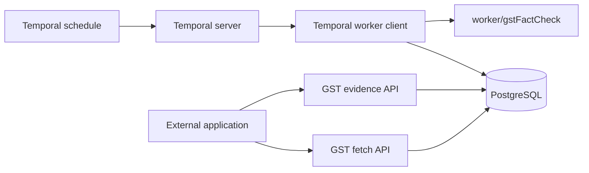

# ComplianceIQ services

The repository groups externally consumed APIs, scheduled browser workers, and
database schema scripts by responsibility.

```text
app.py                Shared FastAPI application entrypoint
api/v1/gstEvidence/   GST acknowledgment and evidence router
api/v1/gstFetch/      GST cache router
worker/gstEvidence/   GST acknowledgment browser automation
worker/gstFactCheck/  GST taxpayer fact-check browser automation
temporal/             Temporal workflow, activities, worker client, and schedule
prisma/               Prisma models and SQL schema scripts
helpers/              Shared async Prisma client
docker-compose.yml    Shared service definitions
```

## Service boundaries

Both route groups are mounted in one API app and serve external applications.
They are independent of Temporal and do not trigger or schedule workers.
Temporal schedules workflows; a Temporal worker client dispatches work to
`worker/gstFactCheck` and persists results.



The fact-check workflow syncs GSTIN secrets from an Infisical project into
`"Automation"."gstFetch"`, reads the active rows, runs the
GST bot, reads its JSON output, then updates the matching row in
`"Automation"."gstFetch"`. It writes `business_info`, `filing_tables`, `legal_name`,
`status`, location fields, `fetched_at`, and `fetch_count`. The current worker
code does **not** write to `Automation.gstbot`; that target table is not
referenced in the repository yet.

The Temporal activities call the unexposed `complaince-api-internal` service to
sync, read, and update GST records. The worker has no Infisical credential and
does not need a bearer token. The API has PostgreSQL access through Prisma.
Set `INFISICAL_PROJECT_ID` and either `INFISICAL_TOKEN` or the machine identity
pair `INFISICAL_CLIENT_ID`/`INFISICAL_CLIENT_SECRET` in `.env` before a workflow
runs. The Infisical project should contain only GSTIN secrets. Missing secrets
are marked inactive at the next successful sync; failed syncs change no rows.

The API queries `"Automation"."gstFetch"` and `"Automation"."gstEvidence"`.
The fact-check worker does not currently write to `Automation.gstbot`.

The `worker/gstEvidence` scripts are organized separately. The current Temporal
workflow does not invoke them.

## Frontend API access

The public `complaince-api` service uses `/api/v1` for all application routes
and requires a bearer token except `/api/v1/health`, `/api/v1/auth/*`, and the
Swagger/OpenAPI documentation pages.
Swagger at `http://localhost:8020/docs` can be viewed without a key. To call
an API from Swagger, exchange an issued key through `POST /api/v1/auth/token` using
the `X-API-Key` field, then paste the returned access token into **Authorize**.
The API key is generated per client and never hardcoded in the application.
Each frontend has its own API key, stored only
on that frontend's trusted server. Browser JavaScript must never contain the
API key or `API_JWT_SIGNING_KEY`. Set a private `API_JWT_SIGNING_KEY` of at least
32 characters in `.env` on the API server. Use HTTPS and `API_COOKIE_SECURE=true`
outside local HTTP development.

Provision and manage frontends from the API container:

```bash
docker compose exec complaince-api python -m api.v1.auth.clients create my-frontend --origin https://frontend.example.com
docker compose exec complaince-api python -m api.v1.auth.clients list
docker compose exec complaince-api python -m api.v1.auth.clients usage
docker compose exec complaince-api python -m api.v1.auth.clients rotate my-frontend
docker compose exec complaince-api python -m api.v1.auth.clients revoke my-frontend
```

The key is displayed only on create or rotate. After a user logs in, the
frontend's trusted server exchanges its key using `POST /api/v1/auth/token` with
`X-API-Key` and associates the resulting API session with that user's login.
The API authenticates the frontend client; user login enforcement remains the
frontend server's responsibility. The response includes a 15 minute access
token; an HttpOnly refresh cookie allows `POST /api/v1/auth/refresh` to rotate the
refresh token for seven days. `POST /api/v1/auth/logout` revokes the session. Send
`Authorization: Bearer <access_token>` on API requests. A frontend backend can
hold the API key and relay token exchange so the browser never sees it.
Revocation invalidates all of a frontend's sessions immediately. Client,
session, and authenticated request records are in PostgreSQL `public` tables
`api_clients`, `api_sessions`, and `api_request_audit`.

## Configuration

Configure all API, worker, database, AWS S3, and Infisical settings in the
root `.env` file. Infisical encryption/authentication secrets and external
service credentials must be valid for those integrations to work.

Apply `prisma/sql/001-automation-schema.sql` on a new database, then apply
`prisma/sql/002-api-clients-and-gst-sync.sql` and
`prisma/sql/003-session-key-version.sql`. These add the `public` frontend
access tables and GST sync columns. The application does not run
schema migrations automatically.

The PostgreSQL hostname in `DB_HOST` must resolve from the Docker network used
by this compose project. If PostgreSQL is started by another Compose project,
attach both projects to a shared external Docker network.

## Build images manually

From the repository root, build the API and Temporal worker images:

```bash
docker build -f Dockerfile.api -t complaince-iq-api:manual .
docker build -f Dockerfile.worker -t complaince-iq-temporal-worker:manual .
```

## Start services

```bash
docker compose up -d
```

The `worker` container registers or updates the daily Temporal schedule at
startup, then polls the task queue and executes workflows. The GST schedule
runs at noon India time.

API documentation is available at:

- Both API routers: `http://localhost:8020/docs` (the current `API_PORT`)

The Temporal UI is optional and starts with the `debug` profile:

```bash
docker compose --profile debug up -d temporal-ui
```

Then open `http://localhost:18088`.
